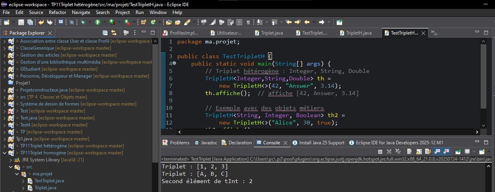
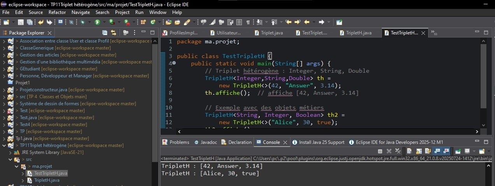

# 🧩 TP11 — Généricité en Java

## 🎯 Objectif général

Ce TP a pour but de maîtriser les bases de la généricité en Java, une notion essentielle pour écrire du code réutilisable, sécurisé et extensible.
Grâce aux génériques, on peut définir des classes, des méthodes ou des interfaces capables de manipuler différents types d’objets sans compromettre la sécurité de type au moment de la compilation.

Ce TP est composé de deux exercices progressifs :

Triplet homogène → introduction aux paramètres de type simples <T>

Triplet hétérogène → introduction aux paramètres de type multiples <A, B, C>

## ⚙️ Environnement de développement

Langage : Java SE 8 ou supérieur

IDE : Eclipse IDE for Java Developers

Encodage : UTF-8


##   🧮 Exercice 1 — Triplet homogène

###  🎓 Objectif pédagogique

L’objectif est d’apprendre à définir une classe générique simple Triplet<T>
permettant de stocker trois objets du même type, tout en conservant la sécurité de type (aucune conversion de type n’est nécessaire).


## Structure de projet
```` bash
TP11_Generique/
│
├── src/
│   └── ma/projet/
│       ├── Triplet.java         
│       ├── TestTriplet.java
````
### 🧠 Concept introduit : le paramètre de type <T>

<T> est un paramètre de type (Type Parameter).

Il représente un type inconnu au moment de la déclaration de la classe.

Lors de l’instanciation, le développeur précise le type concret :
Triplet<Integer> ou Triplet<String> par exemple.

Ainsi, le compilateur garantit que :

Les trois éléments ont le même type ;

Aucune opération illégale (mélange de types) n’est possible
### Résultat visuel
<div align="center">  <p><em>Figure 1</em></p> </div>

##  🧩 Exercice 2 — Triplet hétérogène

### 🎓 Objectif pédagogique

Découvrir comment manipuler des objets de types différents dans une même structure grâce à plusieurs paramètres de type générique.
Ici, la classe TripletH<A, B, C> permet de stocker trois éléments de types potentiellement distincts.


## Structure de projet
```` bash
TP11_Generique/
│
├── src/
│   └── ma/projet/
│       ├── TripletH.java          
│       ├── TestTripletH.java 
````

### 🧠 Concept introduit : plusieurs paramètres de type <A, B, C>

Chaque paramètre représente un type différent :
A pour le premier élément, B pour le second, C pour le troisième.

Cette approche permet de créer des structures flexibles et réutilisables, capables de combiner différents types sans perdre la sécurité de type.
Résultat visuel
<div align="center">  <p><em>Figure 2</em></p> </div>

### 🏁 Conclusion générale

Ce TP illustre clairement la puissance des génériques en Java :

✅ Triplet homogène (<T>) : une structure réutilisable pour un seul type.

✅ Triplet hétérogène (<A, B, C>) : une structure polyvalente pour plusieurs types.

Grâce aux génériques :

Le code est plus sûr (pas de cast explicite).

Le code est plus réutilisable (indépendant des types concrets).

Le code est plus lisible et maintenable, car les erreurs de type sont détectées à la compilation.
